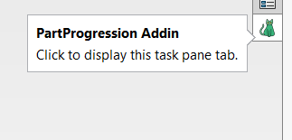
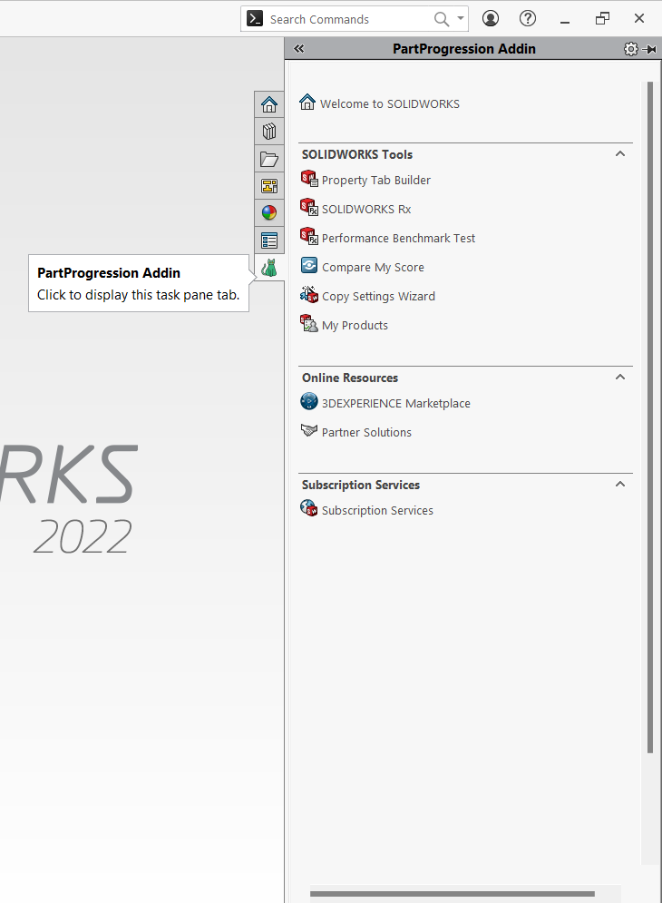
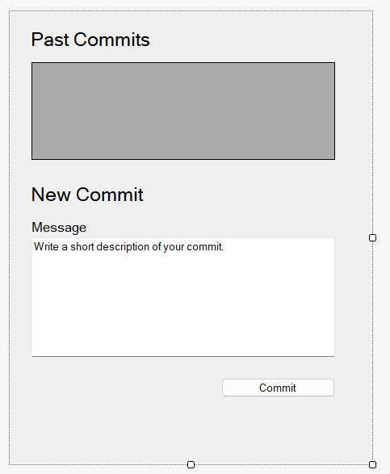

# AnAddin
### Notes
* made in Visual Studio, assembly registers w/ codebase option during Post-Build events
* Current progress:
  * setup of taskpane and layout for filesaving features
  * 
  * 
* Current issue:
  * UI doesn't update, only shows what was in the previous taskpane
  * 
  * 
* What the taskpane should look like:
  * 
  * 
